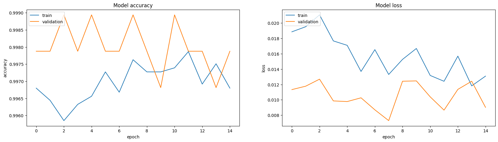

# AI-Captcha_Cracker

I have utilized the CNN model and LSTM to successfully decipher the captchas.

## Overview

This project is an AI-based CAPTCHA solver that leverages Convolutional Neural Networks (CNN) and Long Short-Term Memory (LSTM) networks to decode CAPTCHA images. The code is written in Python and utilizes several libraries for data manipulation, visualization, and model building.

## Model Accuracy

Below is an image showing the accuracy of the model during training:

**The model accuracy is above 99%.**

## Requirements

The following Python libraries are required to run the code:

- `os`: Standard library for interacting with the operating system.
- `numpy`: For numerical operations.
- `pandas`: For data manipulation and analysis.
- `matplotlib`: For plotting and visualizing data.
- `seaborn`: For statistical data visualization.
- `scikit-learn`: For model selection and evaluation.
- `tensorflow`: For building and training deep learning models.